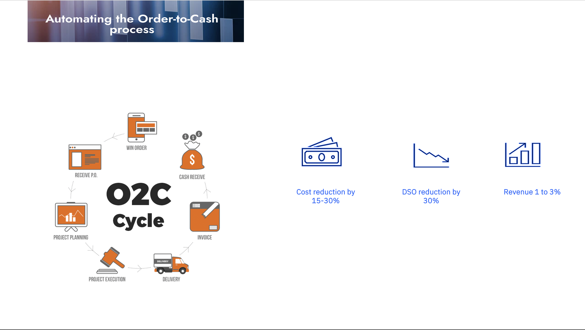

# 💼 Order-to-Cash Automation Agent

## 🔍 Problem Statement

In today’s fast-paced business environment, enterprises face increasing pressure to deliver seamless customer experiences while maintaining efficient internal operations. One of the most critical yet often overlooked functions is the Order-to-Cash (O2C) process — the end-to-end workflow that begins with order placement and ends with payment collection.

As businesses scale, their O2C process becomes increasingly complex, involving multiple departments, systems, and checkpoints. In many organizations, this process is still largely manual, requiring significant effort from operations, finance, and customer service teams to manage orders, generate invoices, track payments, and resolve disputes. This manual handling leads to delays in order processing, frequent invoicing errors, and inefficient payment collection cycles.

To make matters more complex, employees often struggle to find the correct answers for queries relating to O2C process or exception handling processes when dealing with anomalies. Instead of spending time searching through intranet portals or outdated documents, they need immediate, contextual answers to continue their work.

These inefficiencies have a cascading impact:

- Invoices are often disputed or delayed due to errors or mismatches.
- Payments are not collected on time, leading to past-due accounts and cash flow issues.
- Customer satisfaction takes a hit due to slow and error-prone service delivery.
- Employees waste time hunting for queries relating to O2C process or escalating unnecessarily, reducing first-touch resolution.

The traditional approach of managing O2C through siloed systems and human interventions no longer scales with business growth. Organizations are now looking to modernize this process using AI, automation, and Retrieval-Augmented Generation (RAG) to eliminate friction, reduce cycle times, and unlock working capital.

## 🎯 Objective

This solution aims to revolutionize the Order-to-Cash (O2C) process, one of the most critical pillars of business operations, by leveraging AI-powered agentic automation to eliminate manual inefficiencies, reduce errors, and accelerate cash realization. The goal is to design and deploy a multi-agent intelligent system that supports end-to-end automation of the O2C workflow, empowering business teams to deliver faster, more accurate, and customer-centric outcomes.

The AI-powered agentic solution will assist in executing the following key tasks:

- Automate order processing to ensure quick and accurate capture of customer orders.
- Streamline invoice generation and validation to minimize disputes and billing errors.
- Enable real-time tracking and reconciliation of payments to reduce Days Sales Outstanding (DSO).
- Integrate with internal finance tools to retrieve and update financial data via APIs.
- Provide contextual, real-time guidance on queries relating to O2C process using Retrieval-Augmented Generation (RAG), so agents can confidently resolve exceptions or follow escalation procedures.
- Generate dynamic dashboards and summary reports to provide stakeholders with insights into cash flow and performance.

By automating these tasks and integrating RAG-based knowledge support, the organization aims to reduce manual workload, improve cash flow predictability, enhance customer satisfaction, and realize measurable financial impact—positioning the business for greater scalability and agility.

## 📊 Business Value 

Transforming the Order-to-Cash (O2C) process through AI-powered agentic automation and embedded RAG support delivers measurable value across operational efficiency, financial performance, and customer experience. By reducing manual dependencies and embedding intelligence into each step of the O2C cycle—from order capture to payment reconciliation—organizations can unlock new levels of performance and scalability.

Key business benefits observed through this transformation include:

- 15–30% reduction in operational costs by automating repetitive, manual tasks across order entry, invoicing, and collections.
- 30% improvement in Days Sales Outstanding (DSO) through faster invoice generation, better dispute handling, and streamlined payment tracking.
- 1–3% revenue uplift driven by enhanced accuracy, fewer missed billings, and improved service delivery.
- Greater transactional accuracy and compliance, reducing risk and the cost of manual errors.
- Enhanced customer satisfaction through timely, transparent, and reliable order fulfillment and billing.
- Improved agent productivity and decision confidence by using RAG to surface contextual FAQs, escalation paths, and exception handling guidance directly within the workflow—eliminating time lost in document searches and unnecessary escalations.

## 🏛️ Architecture

## 📄 Hands-on step-by-step lab

Please find the step-by-step instructions on how you can implement this use case with the two workflows.

- [Order-to-Cash](./practitioner_docs/hands-on-lab.md)

## 🎥 Demo

https://github.ibm.com/skol/agentic-ai-client-bootcamp/assets/452897/ba04c942-cb09-4a4b-a56c-6a0aa57b9e7d

